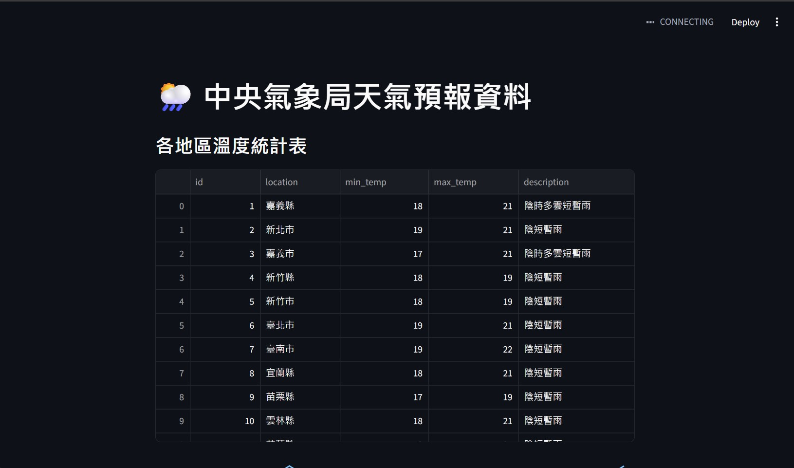
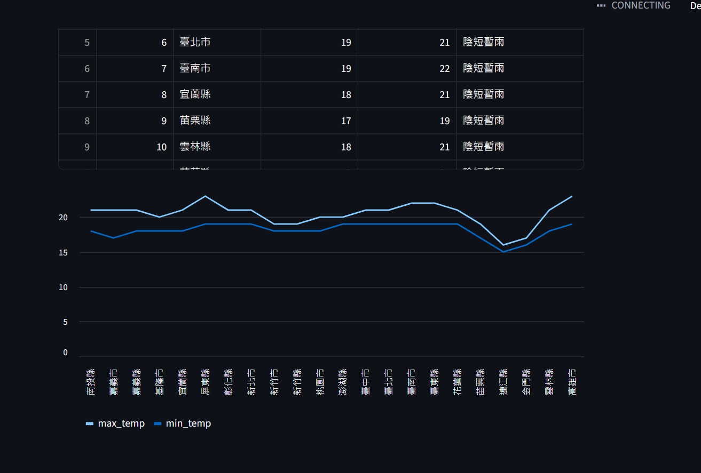

### 🌦️ 資料爬蟲 + SQLite + Streamlit 綜合練習
這份專案是 Lecture 13 的課堂作業，包含了中央氣象署（CWA）API 資料處理、SQLite 資料庫儲存、Streamlit 視覺化呈現，以及電影網站的自動化爬蟲。

### 📁 檔案結構說明
weather_to_sqlite.py: Part 1 氣象資料爬蟲。從 CWA API 獲取全台縣市天氣預報，並存入 SQLite 資料庫。

app.py: Part 1 Streamlit 介面。讀取 data.db 並以表格與圖表形式展示天氣資訊。

data.db: Part 1 產出的 SQLite 資料庫檔案。

movie_crawler.py: Part 2 電影爬蟲。自動爬取 scrape.center 共 10 頁的電影資訊。

movie.csv: Part 2 產出的電影資料清單。

requirements.txt: 專案所需的 Python 套件清單。

### 🛠️ 安裝與執行步驟
1. 安裝必要套件
在終端機執行以下指令：

```Bash

pip install -r requirements.txt
```
2. 執行氣象資料處理 (Part 1)
先執行爬蟲存入資料庫：

``Bash

python weather_to_sqlite.py
```
接著啟動 Streamlit 介面：

```Bash

streamlit run app.py
```
3. 執行電影爬蟲 (Part 2)
執行以下指令獲取 10 頁電影資料：

```Bash

python movie_crawler.py
```
### 📊 實作重點說明
SSL 憑證處理: 針對部分網路環境下的 SSL 驗證問題，在請求中加入了 verify=False 確保資料抓取穩定。

JSON 結構自動偵測: 程式具備容錯機制，能自動適應 CWA API 不同層級的 JSON 回傳格式。

資料持久化: 使用 SQLite 進行結構化儲存，確保資料能被 Streamlit 快速讀取與檢索。

反爬蟲應對: 電影爬蟲加入了 time.sleep 停頓，並處理了分頁爬取的邏輯。


